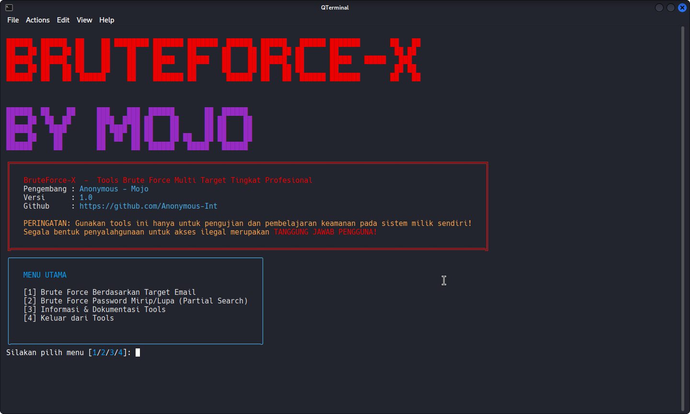

##  Daftar Isi
- [Deskripsi](#-deskripsi)
- [Tampilan](#-tampilan)
- [Fitur Utama](#-fitur-utama)
- [Cara Install](#-cara-install)
- [Konfigurasi](#-konfigurasi)
- [Contoh Output](#-contoh-output)
- [Kontribusi](#-kontribusi)
- [Disclaimer](#-disclaimer)

<p align="center">
  
</p>

<h1 align="center"><b>BruteForce-X</b></h1>
<p align="center">
  <b>Advanced Multi Target Brute Force Tools</b><br>
  
  
  
  
</p>
<p align="center">
  
  
  
</p>


---

##  Deskripsi

**BruteForce-X** adalah tools brute force password generasi terbaru untuk simulasi dan edukasi keamanan siber.  
Dibangun dengan Python, desain antarmuka interaktif dan visualisasi loading/hasil real-time, tools ini sangat cocok untuk _pentester_, pelajar, serta profesional keamanan IT.

>  **PERINGATAN:**  
> Tools ini hanya untuk riset, edukasi, dan pengujian pada sistem milik sendiri. Segala penyalahgunaan adalah tanggung jawab pengguna.

---

##  Tampilan



---

##  Fitur Utama

- [x] Multi Mode: Brute Force Target Email & Password Mirip
- [x] Progress Loading Real-time (ala hacker)
- [x] Tampilan CLI berwarna, profesional, dan menarik
- [x] Hasil otomatis tersimpan & auto open (Windows/Linux/Mac)
- [x] Wordlist custom (bisa pakai wordlist sendiri)
- [x] Kompatibel **Linux, Windows, Mac**, dan **Termux (Android)**
- [x] Proses loading dan animasi real-time

---

##  Cara Install

### **Untuk Linux / MacOS**
1. **Clone Repo**
    ```bash
    git clone https://github.com/Anonymous-Int/BruteForce-X.git
    cd BruteForce-X
    ```
2. **Install Dependency**
    ```bash
    pip install rich tqdm
    ```
3. **Jalankan Tools**
    ```bash
    python brute_force_x.py
    ```
   > **Note:**  
   > File hasil otomatis terbuka dengan `xdg-open` (Linux) atau `open` (MacOS).

---

### **Untuk Windows**
1. **Clone Repo via Git Bash/CMD/PowerShell**
    ```bash
    git clone https://github.com/Anonymous-Int/BruteForce-X.git
    cd BruteForce-X
    ```
2. **Install Dependency**
    ```bash
    pip install rich tqdm
    ```
3. **Jalankan Tools**
    ```bash
    python brute_force_x.py
    ```
   > **Note:**  
   > File hasil (`hasil.txt`) akan otomatis terbuka menggunakan Notepad **dalam keadaan minimize** setelah brute force selesai.

---

### **Untuk Termux (Android)**
1. **Update & Install Python**
    ```bash
    pkg update && pkg upgrade
    pkg install python git
    ```
2. **Clone Repo**
    ```bash
    git clone https://github.com/Anonymous-Int/BruteForce-X.git
    cd BruteForce-X
    ```
3. **Install Dependency**
    ```bash
    pip install rich tqdm
    ```
4. **Jalankan Tools**
    ```bash
    python brute_force_x.py
    ```
    > **Note Termux:**  
    > Pada Termux, file hasil **tidak terbuka otomatis**. Silakan buka manual via:
    > ```
    > cat hasil.txt
    > ```
    > atau editor favoritmu.

---

## ⚙ Konfigurasi

- **File Wordlist**:  
  Edit atau tambahkan password di file `wordlist.txt` sesuai kebutuhan simulasi.
- **Target Email & Password** (untuk simulasi):  
  Ubah di kode, variabel `HARDCODED_EMAIL` & `HARDCODED_PASSWORD`.

---

##  Contoh Output

╔═══════════════════════════════════════════════════════════╗
║ BruteForce-X - Tools Brute Force Multi Target Tingkat Pro ║
╚═══════════════════════════════════════════════════════════╝

[✔] AUTENTIKASI BERHASIL!

Email : mojoofficial16@gmail.com
Password: mojo1212

Hasil brute force telah tersimpan di file: hasil.txt

---

##  Kontribusi

Pull Request, bug report, dan request fitur sangat diterima.  
Jangan lupa bintang ⭐ repo ini jika bermanfaat!

---

##  Disclaimer

Penggunaan BruteForce-X sepenuhnya tanggung jawab pengguna.  
Penulis hanya menyediakan tools untuk edukasi, riset, dan pembelajaran keamanan siber!

---

<p align="center">
  <b>Developed with by Mojo | Anonymous-Int</b>
</p>
